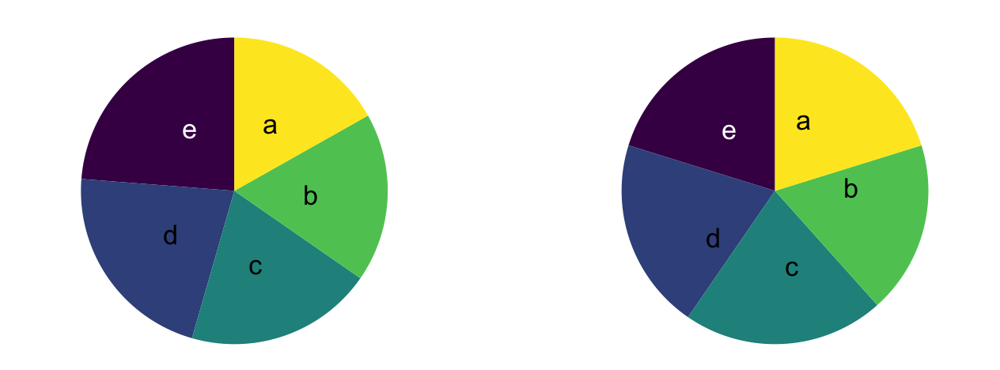
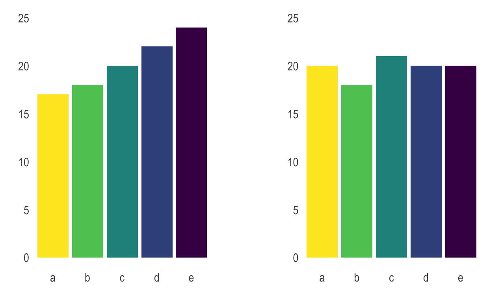

```{r setup, include=FALSE, message=FALSE, warning=FALSE}
options(htmltools.dir.version = FALSE)
library(tidyverse)
library(kableExtra)
library(knitr)
xaringanExtra::use_extra_styles(
  hover_code_line = TRUE,         #<<
  mute_unhighlighted_code = TRUE #<<
)
xaringanExtra::use_tile_view()
xaringanExtra::use_scribble()
xaringanExtra::use_fit_screen()
options(htmltools.dir.version = FALSE)
theme_set(theme_bw())

```


background-size: cover
class: animated slideInRight fadeOutLeft, middle

```{r xaringan-extra-styles, include=FALSE}
xaringanExtra::use_extra_styles(
  hover_code_line = TRUE,         #<<
  mute_unhighlighted_code = TRUE  #<<
)
```


```{r include=FALSE}
library(countdown)
```

```{r xaringan-themer, include=FALSE, warning=FALSE}
library(xaringanthemer)
style_duo_accent(
  primary_color = "#655582",
  secondary_color = "#534173",
  inverse_header_color = "#FFFFFF"
)
```

```{r , message=FALSE, warning=FALSE, include=FALSE} 
library(fontawesome)
library(emo)
```

```{r xaringan-logo, echo=FALSE}
xaringanExtra::use_logo("logo.png")
```


```{r xaringan-tachyons, echo=FALSE}
xaringanExtra::use_tachyons()
xaringanExtra::use_fit_screen()
```

<br/> 
# <h1 style="font-size:80px;">**Visualización de datos con R y ggplot**</h1>
### Parte 1
### Jesica Formoso
<br/> <br/> 
#### <h4 style="color:#655582;"> Laboratorio de Análisis Estadístico de la Facultad de Psicología</h4>


---
class: center, top
<!-- Diapo 1 --> 

<br/>
## Visualización de datos
<br/>
.left[
- Representar información por medio de gráficos para: 
  
  - Explorar nuestros datos: Ayuda a identificar patrones, valores atípicos, tendencias y distribuciones. 
  
  - Comunicar datos a terceros de forma eficiente: condensan mucha información en un espacio acotado y facilitan su interpretación. ]

---

class: center, top
<!-- Diapo 2 --> 
<br/>
## ¿Por qué usar ggplot2?
<br/>

.left[
- Tiene una **gramática** subyacente (Gramática de gráficos de Wilkinson):
  - Conjunto de componentes.
  - Reglas para combinarlos.
]

.left[
- Es muy flexible y fomenta el uso de gráficos diseñados para un problema particular en lugar de depender de estructuras genéricas.
]

.left[
- Es parte del **tidyverse**, un conjuntos de paquetes de R que comparten una gramática común para la exploración, manipulación y visualización con datos ordenados. 
]


---
<!-- Diapo 3 --> 
<br/>
## Estructura de los gráficos de ggplot 
<br/>

- <p style="color:#C70039;font-size:30px;">Conjunto de datos</p>

- <p style="color:#C70039;font-size:30px;">Mapeo de las variables a atributos estéticos (aes)</p>

- <p style="color:#C70039;font-size:30px;">Representaciones geométricas (geoms) </p>

- Facetas

- Escalas

- Coordenadas

- Temas

---
<!-- Diapo 4 --> 
<br/>
## Como organizar los datos

<br/><br/>


- Cada variable se ubica en una columna

- Cada observación en una fila

- Cada valor en una celda
---
<!-- Diapo 5 --> 
<br/>
## Como organizar los datos

```{r datos-tidy, echo=FALSE, message=FALSE, warning=FALSE}

peso <- read_csv("peso.csv")

peso <- peso %>% 
  mutate(Peso = round(Peso, 0),
         Altura = round(Altura, 0))

a <- head(peso, 10)
a$id <- 1:10
a <- relocate(a, id)


a %>% 
  kable(booktabs = T) %>%
  kable_paper("hover", full_width = F)

```

---
<!-- Diapo 6 --> 
<br/>
## Como organizar los datos


```{r datos-tidy2, echo=FALSE, message=FALSE, warning=FALSE}
b <- rbind(a,a)
b$Dieta <- rep(c("Pre", "Post"), each = 10)
b <- relocate(b, Dieta, .after = id)
b <- head(arrange(b, id), 10)

b %>% 
  kable(booktabs = T) %>%
  kable_paper("hover", full_width = F)


Base_datos <- peso[sample(1:10000, 100),]
Base_datos$id <- 1:100

```

---
<!-- Diapo 7 --> 
<br/>
## Un error muy común

```{r error-datos, echo=FALSE, warning=FALSE, message=FALSE}

id <- 1:10
Sexo <- sample(c("Femenino", "Masculino"), 10, replace = TRUE)
Peso1 <- sample(58:90, 10, replace = TRUE)
Peso2 <- round(Peso1-rnorm(n = 10, 2, 1),0)
Peso3 <- round(Peso1-rnorm(n = 10, 5, 2),0)

c <- data.frame(id, Sexo, Peso1, Peso2, Peso3)


c %>% 
  kable(booktabs = T) %>%
  kable_paper("hover", full_width = F)


```


---
<!-- Diapo 8 --> 

<br/>
## Definir la base de datos

```{r alt_peso, message=FALSE, warning=FALSE, fig.asp = 0.8, fig.width = 4, out.width="60%",fig.align='center', dpi=300}

ggplot(data = Base_datos)

```


---
<!-- Diapo 9 --> 
<br/>
## Definir las variables que serán representadas en el gráfico

```{r alt_peso2, message=FALSE, warning=FALSE, fig.asp = 0.8, fig.width = 4, out.width="56%",fig.align='center', dpi=300}

ggplot(data = Base_datos,
       mapping = aes(x = Altura, y = Peso))

```
---
<!-- Diapo 10 --> 
<br/>
## Definir la forma en que van a representarse esas variables

```{r alt_peso3, message=FALSE, warning=FALSE, fig.asp = 0.8, fig.width = 4, out.width="56%",fig.align='center', dpi=300}

ggplot(data = Base_datos,
       mapping = aes(x = Altura, y = Peso)) +
  geom_point() 

```

---
<!-- Diapo 11 --> 
<br/>
## Posición

```{r alt_peso4,echo=FALSE,message=FALSE, warning=FALSE, fig.asp = 0.8, fig.width = 4, out.width="50%",fig.align='center', dpi=300}

ggplot(data = Base_datos,
       mapping = aes(x = Altura, y = Peso)) +
  geom_point() 

```
<br/>
- Cada observación es un punto, ubicado de acuerdo a los valores que tiene en dos variables. 
- Cada punto tiene un tamaño, un color y una forma. 
- Las variables pueden mapearse a estos atributos. 
---
<!-- Diapo 12 --> 
<br/>
## Color, forma y tamaño

```{r alt_peso5, message=FALSE, warning=FALSE, fig.asp = 0.8, fig.width = 4, out.width="60%",fig.align='center', dpi=300}

ggplot(data = Base_datos,
       mapping = aes(x = Altura, y = Peso, color = Sexo)) +
  geom_point()

```
---
<!-- Diapo 13 --> 
<br/>
## Color, forma y tamaño

```{r alt_peso6, echo=FALSE, message=FALSE, warning=FALSE, fig.asp = 0.8, fig.width = 4, out.width="40%",fig.align='center', dpi=300}

ggplot(data = Base_datos,
       mapping = aes(x = Altura, y = Peso, color = Sexo)) +
  geom_point()
```
<br/>
- Cada observación tiene una posición determinada en base al valor que toma en las variables peso y altura. 
- Cada observación tiene un color determinado en base al valor que toma en la variable sexo. 

---
<!-- Diapo 14 --> 
<br/>
## Color, forma y tamaño

```{r alt_peso7, echo=FALSE, message=FALSE, warning=FALSE, fig.asp = 0.8, fig.width = 4, out.width="65%",fig.align='center', dpi=300}

library(gghighlight)

id.p <- 10

ggplot(data = Base_datos,
       mapping = aes(x = Altura, y = Peso, color = Sexo)) +
  geom_point() +
  gghighlight(id == id.p, label_key = id)

```
<br/>
El sujeto con ID `r id.p` pesa `r round(Base_datos$Peso[id.p],0)` kg, mide `r round(Base_datos$Altura[id.p], 0)` cm y es de sexo `r Base_datos$Sexo[id.p]`.

---
<!-- Diapo 15 --> 
<br/>
## Color, forma y tamaño

```{r alt_peso6b, message=FALSE, warning=FALSE, fig.asp = 0.8, fig.width = 4, out.width="60%",fig.align='center', dpi=300}

ggplot(data = Base_datos,
       mapping = aes(x = Altura, y = Peso, shape = Sexo)) +
  geom_point()

```

---
<!-- Diapo 16 --> 
<br/>
## Color, forma y tamaño

```{r alt_peso6c, message=FALSE, warning=FALSE, fig.asp = 0.8, fig.width = 4, out.width="60%",fig.align='center', dpi=300}

ggplot(data = Base_datos,
       mapping = aes(x = Altura, y = Peso, size = Sexo)) +
  geom_point()

```

---
<!-- Diapo 17 --> 
<br/>
## Color, forma y tamaño
.pull-left[
```{r alt_peso6e, message=FALSE, warning=FALSE, fig.asp = 0.6, fig.width = 4, out.width="90%",fig.align='center', dpi=300}

ggplot(data = Base_datos,
       mapping = aes(x = Altura, 
                     y = Peso)) +
  geom_point(aes(color = Sexo))

```
]

.pull-right[
```{r alt_peso6d, message=FALSE, warning=FALSE, fig.asp = 0.8, fig.width = 4, out.width="80%",fig.align='center', dpi=300}

ggplot(data = Base_datos,
       mapping = aes(x = Altura, 
                     y = Peso)) +
  geom_point(color = "green")

```
]

---
<!-- Diapo 18 --> 

<br/>
## Objetos geométricos (geoms)

```{r alt_peso8, message=FALSE, warning=FALSE, fig.asp = 0.8, fig.width = 4, out.width="60%",fig.align='center', dpi=300}

ggplot(data = Base_datos,
       mapping = aes(x = Altura, y = Peso, color = Sexo)) +
  geom_line()

```

---
<!-- Diapo 19 --> 
<br/>
## Objetos geométricos(geoms)

```{r alt_peso9, message=FALSE, warning=FALSE, fig.asp = 0.8, fig.width = 4, out.width="60%",fig.align='center', dpi=300}

ggplot(data = Base_datos,
       mapping = aes(x = Altura, y = Peso, color = Sexo)) +
  geom_bar(stat = "identity", position = "identity")

```
---

class: center, middle
<!-- Diapo 20 --> 

# <h1 style="font-size:80px;">**Vamos a R..**</h1>


---
<!-- Diapo 21 --> 
<br/>
## Estructura de los gráficos de ggplot 
<br/>

- Conjunto de datos

- Mapeo de las variables a atributos estéticos (Aesthetics)

- Representaciones geométricas (geoms)

- <p style="color:#C70039;font-size:30px;">Facetas</p>

- <p style="color:#C70039;font-size:30px;">Escalas</p>

- Coordenadas

- Temas

---
<!-- Diapo 21 --> 
<br/>
## Facetas
<br/>
Generan múltiples gráficos con iguales características pero que describen subgrupos de los datos. 

- facet_null(): es el valor por defecto. Grafica un único panel. 

- facet_wrap(): genera un gráfico por cada nivel de una variable categórica. Permite organizarlos en más de una fila o columna. 

- facet_grid(): genera una matriz de gráficos en base a una o más variables categóricas. 

---
<!---Diapo22--->
<br/>
## Facetas

```{r facet1, echo=FALSE, message=FALSE, warning=FALSE}

id <- 1:90 
grupo <- rep(c("Control", "Tratamiento A", "Tratamiento B"),
             each = 30)

edad <- sample(18:39, 90, replace = TRUE)

sexo <- sample(c("Femenino", "Masculino"), 90, replace = TRUE)

area <- sample(c("Urbana", "Rural"), 90, replace = TRUE)

pC <- sample(c("Bajo", "Medio", "Alto"), 30, replace = TRUE, prob = c(0.15, 0.25, 0.50))

ptB <- sample(c("Bajo", "Medio", "Alto"), 30, replace = TRUE, prob = c(0.50, 0.40, 0.10))

ptA <- sample(c("Bajo", "Medio", "Alto"), 30, replace = TRUE, prob = c(0.30, 0.40, 0.30))

ansiedad <- c(pC, ptA, ptB)

ej <- data.frame(id, sexo, edad, area, grupo, ansiedad)

ej1 <- ej[sample(1:90, 10),]

ej1 %>% 
  kable(booktabs = T) %>%
  kable_paper("hover", full_width = F)


```

---
<!---Diapo23--->

# Facetas
```{r fac1, message=FALSE, warning=FALSE, fig.asp = 0.8, fig.width = 4, out.width="60%",fig.align='center', dpi=300}

ggplot(data = ej,
       mapping = aes(x = ansiedad)) +
  geom_bar()

```
---
<!---Diapo23--->

# Facetas
```{r fac2, message=FALSE, warning=FALSE, fig.asp = 0.8, fig.width = 4, out.width="60%",fig.align='center', dpi=300}

ggplot(data = ej,
       mapping = aes(x = ansiedad, fill = grupo)) +
  geom_bar(position = "dodge")

```
---
# Facetas
```{r fac3, message=FALSE, warning=FALSE, fig.asp = 0.5, fig.width = 6, out.width="80%",fig.align='center', dpi=300}

ggplot(data = ej,
       mapping = aes(x = ansiedad, fill = grupo)) +
  geom_bar(position = "dodge") +
  facet_wrap(~ sexo)

```
---

<br/>
## Escalas
<br/>
Controlan como se mapean los datos a las aesthetics (posición, color, tamaño, forma).

Los tipos de variables y los aesthetics generan ciertas escalas por defecto:

- scale_x_continuos (Altura).

- scale_y_continuos (peso).

- scale_color_discrete (sexo).

---
<!-- Diapo 22 --> 
<br/>
## Escalas
<br/>
La estructura general es scale_*:

- posición scale\_x\_\* y scale\_y\_\*

- color scale\_color\_\* y scale\_fill\_\*

- forma scale\_shape\_\*

- tamaño scale\_size\_\*

- transparencia scale\_alpha\_\*

---
<!-- Diapo 16 --> 
<br/>
## Escalas

```{r esc1, message=FALSE, warning=FALSE, fig.asp = 0.8, fig.width = 4, out.width="60%",fig.align='center', dpi=300}

ggplot(data = Base_datos,
       mapping = aes(x = Altura, y = Peso, color = Sexo)) +
  geom_point()

```

---

<!-- Diapo 23 --> 
## Escalas

```{r esc2, message=FALSE, warning=FALSE, fig.asp = 0.8, fig.width = 4, out.width="55%",fig.align='center', dpi=300}

ggplot(data = Base_datos,
       mapping = aes(x = Altura, y = Peso, color = Sexo)) +
  geom_point() +
  scale_y_continuous(name = "Peso en kg", 
                     limits = c(40, 70))
```
---
<!-- Diapo 24 --> 
## Escalas


```{r esc3, message=FALSE, warning=FALSE, fig.asp = 0.8, fig.width = 4, out.width="55%",fig.align='center', dpi=300}

ggplot(data = Base_datos,
       mapping = aes(x = Altura, y = Peso, color = Sexo)) +
  geom_point() +
  scale_y_continuous(name = "Categoría de peso", 
                     breaks = c(40, 70, 90),
                     labels = c("Bajo", "Medio", "Alto"))
```

---
<!-- Diapo 25 --> 
## Escalas


```{r esc4, message=FALSE, warning=FALSE, fig.asp = 0.8, fig.width = 4, out.width="55%",fig.align='center', dpi=300}

ggplot(data = ej,
       mapping = aes(x = ansiedad, fill = grupo)) +
  geom_bar(position = "dodge") 

```
---
<!-- Diapo 25 --> 
## Escalas


```{r esc5, message=FALSE, warning=FALSE, fig.asp = 0.8, fig.width = 4, out.width="55%",fig.align='center', dpi=300}

ggplot(data = ej,
       mapping = aes(x = ansiedad, fill = grupo)) +
  geom_bar(position = "dodge") +
  scale_x_discrete(limits = c("Bajo", "Medio", "Alto"))

```

---
<!-- Diapo 25 --> 
## Escalas


```{r esc6, message=FALSE, warning=FALSE, fig.asp = 0.8, fig.width = 4, out.width="55%",fig.align='center', dpi=300}

ggplot(data = ej,
       mapping = aes(x = ansiedad, fill = grupo)) +
  geom_bar(position = "dodge") +
  scale_x_discrete(limits = c("Bajo", "Medio", "Alto")) +
  scale_y_continuous(labels = scales::label_percent(accuracy = 0.01, 
                                                    scale = 1))
```

---

class: center, middle
<!-- Diapo 20 --> 

# <h1 style="font-size:80px;">**Vamos a R..**</h1>


---
<!-- Diapo 21 --> 
<br/>
## Estructura de los gráficos de ggplot 
<br/>

- Conjunto de datos

- Mapeo de las variables a atributos estéticos (Aesthetics)

- Representaciones geométricas (geoms)

- Facetas

- Escalas

- <p style="color:#C70039;font-size:30px;">Coordenadas</p>

- Temas

---

## Coordenadas

Los sistemas de coordenadas combinan las dos posiciones (aestheticas X e y) para ubicar los distintos elementos en un gráfico de 2 dimensiones. 

- coord_cartesian(): Coordenadas por defecto. 

- coord_flip(): Coordenadas cartesianas pero invertidas. 

- coord_fixed(): Coordenadas cartesianas con una proporción fija entre el ancho y el alto del gráfico. 

- coord_polar(): Coordenadas polares, cada posición está determinada por una distancia y un ángulo.

---
<!-- Diapo 16 --> 
<br/>
## Coordenadas

```{r coord1, message=FALSE, warning=FALSE, fig.asp = 0.8, fig.width = 4, out.width="60%",fig.align='center', dpi=300}

ggplot(data = ej,
       mapping = aes(x = ansiedad, fill = grupo)) +
  geom_bar(position = "dodge") 

```

---
<!-- Diapo 16 --> 
<br/>
## Coordenadas

```{r coord2, message=FALSE, warning=FALSE, fig.asp = 0.8, fig.width = 4, out.width="60%",fig.align='center', dpi=300}

ggplot(data = ej,
       mapping = aes(x = ansiedad, fill = grupo)) +
  geom_bar(position = "dodge") +
  coord_flip()

```
---
<!-- Diapo 16 --> 
<br/>
## Coordenadas

```{r coord3, message=FALSE, warning=FALSE, fig.asp = 0.8, fig.width = 4, out.width="60%",fig.align='center', dpi=300}

ggplot(data = ej,
       mapping = aes(x = ansiedad, fill = grupo)) +
  geom_bar(position = "dodge") +
  coord_polar()

```

---
<!-- Diapo 16 --> 
<br/>
## Coordenadas

```{r coord4, message=FALSE, warning=FALSE, fig.asp = 0.8, fig.width = 4, out.width="40%",fig.align='center', dpi=300}

ej %>% 
  count(ansiedad) %>% 
  mutate(porcentaje = round(n/sum(n)*100), 0) %>% 
  ggplot(mapping = aes(factor(1), y = porcentaje, fill = ansiedad)) +
  geom_bar(stat = "identity") +
  coord_polar(theta = "y") +
  theme_void() +
  geom_text(aes(label = paste(porcentaje,"%", sep = "")),
            position = position_stack(vjust = 0.5))


```

---
## Por qué es mejor evitar los<br/>gráficos de sectores

.left-column[

### **Visualización**

Resulta más difícil discriminar
las diferencias entre categorías.

]

.right-column[

```{r echo=FALSE, out.width='90%'}

```

```{r echo=FALSE, out.width='90%'}

```


]

---
## Por qué es mejor evitar los<br/>gráficos de sectores

.pull-left[

### **Representación de la información**
No son útiles con variables ordinales o con muchas categorías.


```{r echo=FALSE, out.width='100%'}

```


]

.pull-right[

```{r echo=FALSE, out.width='110%'}

```


]

---
## Por qué es mejor evitar los<br/>gráficos de sectores

.left-column[

### **Popularidad**
¡Tienen mala prensa!

]

.right-column[

```{r echo=FALSE, out.width='80%'}

```


]

---
<!-- Diapo 16 --> 
<br/>
## Coordenadas: seleccionar<br/>observaciones vs amplificar
<br/>

- **Seleccionar**: si establecemos el rango de valores que nos interesa graficar con <span style="color:#C70039;">scale\_*\_continuous()</span> graficamos las observaciones dentro de ese rango.  

- **Zoom**: si establecemos el rango de valores con <span style="color:#C70039;">coord_cartesian()</span> amplificamos un segmento particular del gráfico, pero se toman en cuenta todas las observaciones.  

---

## Seleccionar observaciones vs<br/>amplificar

```{r puntos1, message=FALSE, warning=FALSE, fig.asp = 0.8, fig.width = 4, out.width="50%",fig.align='center', dpi=300}


ggplot(data = Base_datos, aes(x = Altura, y = Peso)) +
  geom_point() 


```

---

## Seleccionar observaciones vs<br/>amplificar

```{r puntos2, message=FALSE, warning=FALSE, fig.asp = 0.8, fig.width = 4, out.width="50%",fig.align='center', dpi=300}


ggplot(data = Base_datos, aes(x = Altura, y = Peso)) +
  geom_point() +
  geom_smooth(method = "lm")


```

---

## Seleccionar observaciones vs<br/>amplificar

```{r datos4, echo=FALSE}

as <- data.frame("Femenino", 187, 69, 101) 
names(as) <- names(Base_datos)
Base_datos <- rbind(Base_datos, as)

as <- data.frame("Masculino", 190, 72, 102) 
names(as) <- names(Base_datos)
Base_datos <- rbind(Base_datos, as)

as <- data.frame("Masculino", 195, 65, 103) 
names(as) <- names(Base_datos)
Base_datos <- rbind(Base_datos, as)


as <- data.frame("Masculino", 185, 72, 104) 
names(as) <- names(Base_datos)
Base_datos <- rbind(Base_datos, as)

as <- data.frame("Masculino", 188, 67, 105) 
names(as) <- names(Base_datos)
Base_datos <- rbind(Base_datos, as)

as <- data.frame("Masculino", 193, 73, 106) 
names(as) <- names(Base_datos)
Base_datos <- rbind(Base_datos, as)

```


```{r coord5, message=FALSE, warning=FALSE, fig.asp = 0.8, fig.width = 4, out.width="50%",fig.align='center', dpi=300}


ggplot(data = Base_datos, aes(x = Altura, y = Peso)) +
  geom_point() 


```

---


## Seleccionar observaciones vs<br/>amplificar

```{r coord6, message=FALSE, warning=FALSE, fig.asp = 0.8, fig.width = 4, out.width="50%",fig.align='center', dpi=300}

ggplot(data = Base_datos, aes(x = Altura, y = Peso)) +
  geom_point() +
  geom_smooth(method = "lm")  


```

---

<!-- Diapo 16 --> 

## Seleccionar observaciones vs<br/>amplificar

```{r coord7, message=FALSE, warning=FALSE, fig.asp = 0.8, fig.width = 4, out.width="50%",fig.align='center', dpi=300}

ggplot(data = Base_datos, aes(x = Altura, 
                              y = Peso)) +
  geom_point() +
  geom_smooth(method = "lm") +
  scale_x_continuous(limits = c(140, 180))


```

---

## Seleccionar observaciones vs<br/>amplificar

```{r coord8, message=FALSE, warning=FALSE, fig.asp = 0.8, fig.width = 4, out.width="50%",fig.align='center', dpi=300}

ggplot(data = Base_datos, aes(x = Altura, 
                              y = Peso)) +
  geom_point() +
  geom_smooth(method = "lm") +
  coord_cartesian(xlim = c(140, 180))


```


---

## Seleccionar observaciones vs<br/>amplificar

.pull-left[
```{r coord11, echo=FALSE, message=FALSE, warning=FALSE, fig.asp = 0.8, fig.width = 4, out.width="100%",fig.align='center', dpi=300}

ggplot(data = Base_datos, aes(x = Altura, 
                              y = Peso)) +
  geom_point() +
  geom_smooth(method = "lm") +
  coord_cartesian(xlim = c(140, 180)) +
  ggtitle("coord_cartesian()")


```
]

.pull-right[
```{r coord12, echo=FALSE, message=FALSE, warning=FALSE, fig.asp = 0.8, fig.width = 4, out.width="100%",fig.align='center', dpi=300}

ggplot(data = Base_datos, aes(x = Altura, 
                              y = Peso)) +
  geom_point() +
  geom_smooth(method = "lm") +
  scale_x_continuous(limits = c(140, 180)) +
  ggtitle("scale_x_continuous()")


```
]

---
<!-- Diapo 21 --> 
<br/>
## Estructura de los gráficos de ggplot 
<br/>

- Conjunto de datos

- Mapeo de las variables a atributos estéticos (Aesthetics)

- Representaciones geométricas (geoms)

- Facetas

- Escalas

- Coordenadas

- <p style="color:#C70039;font-size:30px;">Temas</p>

---
</br>
## Temas (themes)
</br>
Los temas (themes) de ggplot2 controlan todos los aspectos no asociados a los datos como:

- Fuente, tamaño y color del texto,

- Colores del fondo, los ejes, la cuadrícula,

- Posición de la leyenda. 

Entre otros..

---
# Temas predefinidos

```{r temas1, echo=FALSE, message=FALSE, warning=FALSE,fig.asp = 0.8, fig.width = 4, out.width="80%",fig.align='center', dpi=300}

p1 <- ggplot(peso[sample(1:10000, 200),],
             aes(x = Altura, y = Peso)) +
  geom_point() +
  theme_classic() +
  ggtitle("theme_classic()")

p2 <- ggplot(peso[sample(1:10000, 200),],
             aes(x = Altura, y = Peso)) +
  geom_point() +
  theme_bw() +
  ggtitle("theme_bw()")

p3 <- ggplot(peso[sample(1:10000, 200),],
             aes(x = Altura, y = Peso)) +
  geom_point() +
  theme_dark() +
  ggtitle("theme_dark()")


p4 <- ggplot(peso[sample(1:10000, 200),],
             aes(x = Altura, y = Peso)) +
  geom_point() +
  theme_grey() +
  ggtitle("theme_grey()")

library(patchwork)

p1 + p2 + p3 + p4 + 
  plot_layout(ncol = 2)


```

---
</br>
# Función theme()
</br>

La función theme() puede utilizarse para modificar aproximadamente 40 elementos, que pueden agruparse en:

- Gráfico (plot)

- Ejes (axis)

- Leyenda (legend)

- Panel (panel)

- Facetas (facet)

---
</br>
## Elementos del gráfico (plot)
</br>

.left-column[
- plot.background()

- plot.margin()

- plot.caption()

- plot.title()
]

.right-column[
```{r temas2, echo=FALSE, message=FALSE, warning=FALSE,fig.asp = 0.8, fig.width = 4, out.width="80%",fig.align='center', dpi=300}

ggplot(peso[sample(1:10000, 200),],
             aes(x = Altura, y = Peso)) +
  geom_point() +
  ggtitle("Modificar temas") +
  labs(caption = "No está muy bonito") +
  theme(plot.background = element_rect(color = "red",
                                       size = 2),
        plot.margin = margin(1, 1, 3, 3),
        plot.title = element_text(family = "sh", color = "green", angle = 20, vjust = 0, hjust = 0.5),
        plot.caption = element_text(family = "sh", color = "purple", face = "bold"))

```
]
---
</br>
# Elementos de los ejes (axis)
</br>

.left-column[

- axis.line()

- axis.text()

- axis.ticks()

- axis.title()
]

.right-column[

```{r temas3a, echo=FALSE, message=FALSE, warning=FALSE,fig.asp = 0.8, fig.width = 4, out.width="80%",fig.align='center', dpi=300}

ggplot(peso[sample(1:10000, 200),],
             aes(x = Altura, y = Peso)) +
  geom_point() +
  ggtitle("Modificar temas") +
  labs(caption = "No está muy bonito") +
  theme(axis.title = element_text(color = "blue",
                                  size = 16),
        axis.line = element_line(size = 2, color = "red"),
        axis.ticks = element_line(color = "purple", size = 2),
        axis.text.x = element_text(angle = 45, vjust = 0, 
                                   face = "bold", color = "brown"), 
        axis.ticks.length = unit(.5, "cm"))

```

---
</br>
# Elementos de la leyenda (legend)
</br>

.left-column[

- legend.background()

- legend.text()

- legend.position()

- legend.title()
]

.right-column[

```{r temas3, echo=FALSE, message=FALSE, warning=FALSE,fig.asp = 0.8, fig.width = 4, out.width="80%",fig.align='center', dpi=300}

ggplot(peso[sample(1:10000, 200),],
             aes(x = Altura, y = Peso, color = Sexo)) +
  geom_point() +
  ggtitle("Modificar temas") +
  labs(caption = "No está muy bonito") +
  theme(legend.position = "left",
        legend.background = element_rect(
    fill = "lemonchiffon", 
    colour = "grey50", 
    size = 1))

```

]

---

</br>
# Elementos del panel
</br>

.left-column[

- panel.background()

- panel.border()

- panel.grid.mayor()

- panel.grid.minor()
]

.right-column[

```{r temas4, echo=FALSE, message=FALSE, warning=FALSE,fig.asp = 0.8, fig.width = 4, out.width="80%",fig.align='center', dpi=300}

ggplot(peso[sample(1:10000, 200),],
             aes(x = Altura, y = Peso)) +
  geom_point() +
  ggtitle("Modificar temas") +
  labs(caption = "No mejoró demasiado") +
  theme(panel.background = element_rect(fill = "lightblue"),
        panel.border = element_rect(color = "darkblue"),
        panel.grid = element_line(colour = "white", linetype = "dashed"))

```
]

---

</br>
# Elementos de las facetas
</br>

.left-column[

- strip.background()

- strip.text()

- panel.margin()

]

.right-column[

```{r temas5, echo=FALSE, message=FALSE, warning=FALSE,fig.asp = 0.8, fig.width = 4, out.width="80%",fig.align='center', dpi=300}

ggplot(peso[sample(1:10000, 200),],
             aes(x = Altura, y = Peso)) +
  geom_point() +
  ggtitle("Modificar temas") +
  facet_wrap(~ Sexo) +
  theme(
  strip.background = element_rect(fill = "darkblue", color = "grey80", size = 1),
  strip.text = element_text(colour = "white")
)

```

]
---

class: center, middle
<!-- Diapo 20 --> 

# <h1 style="font-size:80px;">**Vamos a R..**</h1>

---

</br>
## Cómo guardar los gráficos
</br>

**Opción 1**: 

Abrir un dispositivo gráfico, generar el gráfico, cerrar el dispositivo. 


```{r save2, message=FALSE, warning=FALSE, eval=FALSE}
jpeg(filename = "Grafico1.jpg", width = 6, height = 6, 
     units = "cm", res = 300)

ggplot(data = Base_datos, aes(x = Altura, y = Peso)) +
  geom_point()

dev.off()
```

Tipos de archivo: jpeg, png, svg, pdf, tiff.
Unidades: cm, px, in, mm. 

---

</br>
## Cómo guardar los gráficos
</br>

**Opción 2**: 

Crear el gráfico y luego utilizar ggsave() de ggplot2. 

```{r save1, message=FALSE, warning=FALSE, eval=FALSE}

ggplot(data = Base_datos, aes(x = Altura, y = Peso)) +
  geom_point()

ggsave("Gráfico1.jpg", plot = last_plot(), width = 6,
       height = 6, units = "cm", dpi = 300)

```


Tipos de archivo: jpeg, png, svg, pdf, tiff.
Unidades: cm, px, in, mm. 
  
---

</br>
## Cómo guardar los gráficos
</br>

**Opción 3**:

Utilizar "Export" en la pestaña de gráficos de RStudio. 

No es recomendable:

- No se controla la calidad de la imagen. 

- Habrá que repetir la operación cada vez que realicemos una modificación en el gráfico o los datos. 

---

class: center, middle
<!-- Diapo 20 --> 

# <h1 style="font-size:80px;">**Vamos a R..**</h1>

---


class: center, middle
<!-- Diapo 20 --> 

# <h1 style="font-size:80px;">**Continuamos la próxima clase**</h1>

